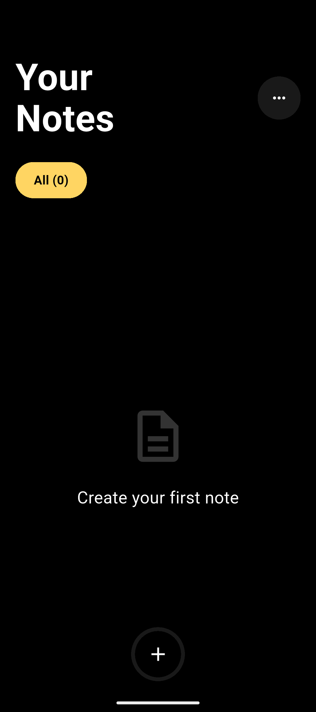
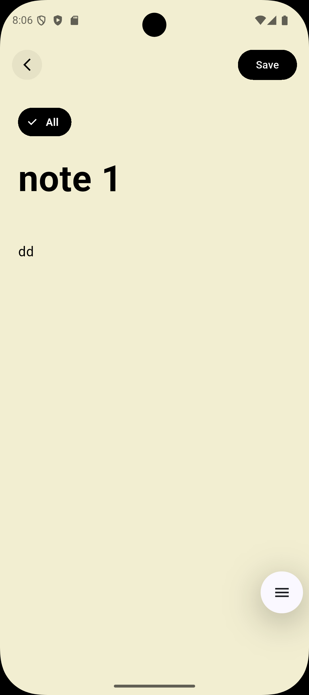
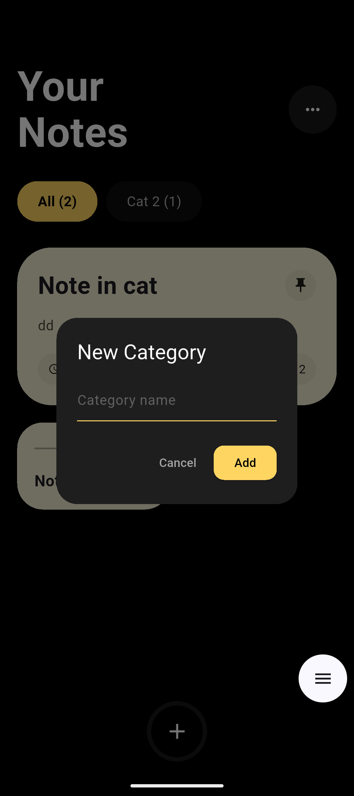
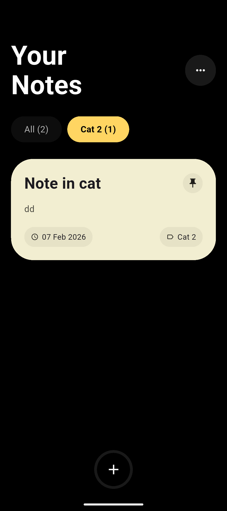

# 📝 Simple Notes

A premium, minimalist note-taking experience built with Flutter, designed for speed and visual elegance.

---

## 📸 Gallery

  
  
  
  

---

## ✨ Features

### 🎨 Visual Excellence

- **Rich Aesthetic**: A sleek, dark-themed interface with vibrant, pastel-colored note cards.
- **Dynamic Layout**: Smart grid system that highlights pinned notes and organizes your thoughts beautifully.
- **Premium Typography**: High-readability fonts and bold headers for a modern feel.

### 🛠 Powerful Functionality

- **Pinning**: Keep your most important notes at the top for quick access.
- **Categorization**: Organize notes into custom categories with a fluid filtering system.
- **Rich Editing**: Distraction-free writing environment with auto-save and easy color customization.

### 🤏 Intuitive Gestures

- **Drag-to-Delete**: A breakthrough interaction where you can **hold and drag** any note to the top-center to delete it instantly.
- **Micro-animations**: Smooth transitions and haptic-like feedback for every action.

---

## 🚀 Getting Started

### Download Latest Version

Get the latest Android build directly:

> **Note**: This link always points to the most recent release. For older versions, please check the [Releases](https://github.com/afnanahmadtariq/Simple-Notes/releases) page.

---

## 🛠 Tech Stack

- **Framework**: [Flutter](https://flutter.dev)
- **State Management**: Stateful Widgets (Minimalist & Fast)
- **Storage**: SharedPreferences (Secure & Local)
- **Icons**: Material Icons & Custom Vectors

Developed with ❤️ by [Afnan Ahmad Tariq](https://github.com/afnanahmadtariq)
